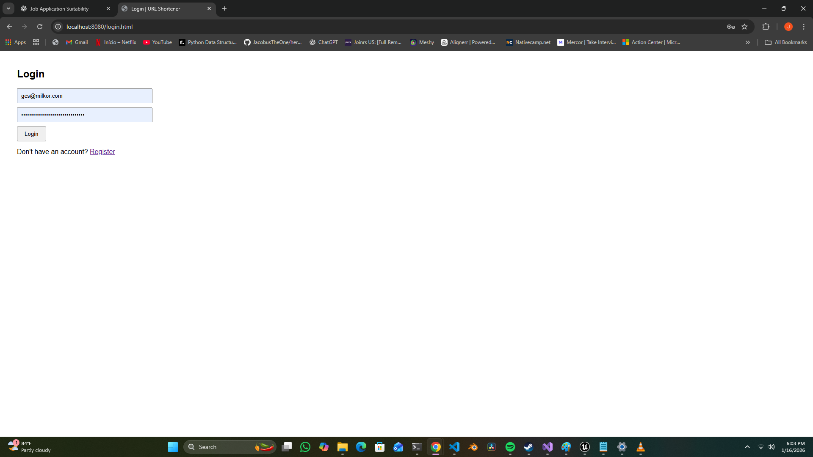

# URL Shortener API

A secure URL shortener built with Spring Boot, JWT authentication,
and a simple frontend interface.

## Features
- User registration & login (JWT-based authentication)
- Create shortened URLs
- Public redirect endpoint
- View all URLs created by logged-in user
- Simple web UI (HTML, CSS, JavaScript)

## Screenshots

### Login

### URL Dashboard

## Tech Stack
- Java 17
- Spring Boot
- Spring Security
- JWT
- H2 Database
- HTML / CSS / JavaScript

## Running locally

./mvnw spring-boot:run

Open:
http://localhost:8080/login.html

## Database

The application uses PostgreSQL in production.
A Docker Compose setup is provided to run the database locally.

Start the full stack:
docker compose up --build